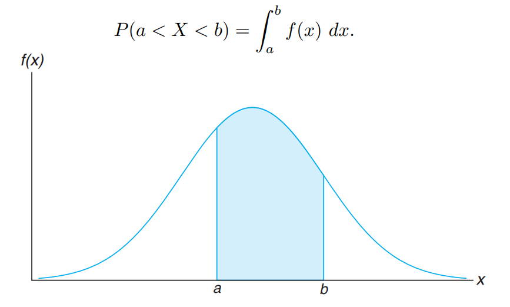

# Contents

* [likelihood](./likelihood/)
* [inverse_cdf](./inverse_cdf)

### Теория

**random variable** - это функция над результатами.

Ниже приведен пример дискретной random variable

|  1  | 2   |  3  |  4  | 5   |
| :---: | ----- | :---: | :---: | ----- |
| 0.1 | 0.1 | 0.2 | 0.2 | 0.2 |

Это значит что исход 1 произойдет с вероятностью 0.1, исход 2 с вероятностью 0.1 и тд.

What do the “identical” and “independent” mean in IID or iid (“identically and independently distributed)?

* “identical” means that each draw is from the same distribution.
* “independent” means that the joint distribution equal tthe product of marginal distributions, i.e.,
* **закон больших** чисел говорит о том что при размере выборке стермящуюся к бесконечности мы получаем устойчивые значения вероятностей в random variable

**cumulative distribution function** - это такая функция которая показывает вероятность какого-то объекта меньше определенного значения

$$
F_{X}(x) = \textrm{Prob}\{X\leq x\}.

$$

**probability density function (density function)** - это функция которая говорит вероятность того что значения random variable, заключены между какими-то величинами. например если представить что таблица выше это какая-то непрерывная область, тогда бы мы считали все что относится к этой области, например межу 2 и 4.

**probability mass function -** это функция которая получается когда мы имеем **random variable,** все вероятности которые содержит random variable должны складываться в 1, по определению.

если речь идет о произвольной случайной величине, к примеру частота встречаемости слов, то все частоты в ней являются параметрами. но чаще всего мы работаем с специальными распределениями, которые описываются малым числом параметров.

**Fisher information** - средняя скорость изменения log likehood оцениваемого параметра на основе данных.(необходимо переосмыслить, дать более человеческий пример)

**[joint distribution](https://python.quantecon.org/prob_matrix.html#bivariate-probability-distributions)** - совместное распределение нескольких переменных. в двумерном дискретном случае чтобы получить вероятность события, нужно перемножить вероятности которорые находятся на пересечении нужных нам элементов. допустим Prob(y=2)=0.2 и Prob(x=3)=0.1, тогда joint probbability будет считаться как $0.2*0.1$.

marginal distributions - это когда мы берем какое-то конкретное значение по одной переменной, и рассматриваем всю остальную случайную переменную.

предположим мы имеем такую таблицу от X и Y, чье joint distribution (в квадратных скобках указано значение которое принимает случайная величина, а рядом вероятность)

| X/Y    | [0] 0.5 | [1] 0.4 |
| -------- | --------- | --------- |
| [0]0.1 | 0.05    | 0.04    |
| [1]0.9 | 0.45    | 0.36    |

marginal distribution в это случае будет например

$Prob(X=0) = 0.05 + 0.04 = 0.09$

$Prob(X=1) =0.45+0.36 = 0.91$

Или говоря простыми словами, одну переменную мы зафиксировали, а другую рассматриваем целиком

continuous marginal distributions - логика остается примерно такая же, мы берем пересечение данных функций. для двумерного случая это будет площадь под кривой.

statistically **independent** variables - когда их условные вероятности равны их произведению. то есть $P(X|Y)=P(X)*P(Y)$

mean(expected value) - это просто среднее ожидание от данных. мы умножаем вероятность получить результат на сам результат - получаем среднее ожидание

variance - это среднее отклонение от expected value

для непрерывных величин тоже самое, только вместо дискретного значка суммы как ниже, используется знак интеграла.

$$
\begin{aligned}
\mu_{X} & \equiv\mathbb{E}\left[X\right] 
=\sum_{k}k \textrm{Prob}\{X=k\} \\ 
\sigma_{X}^{2} & \equiv\mathbb{D}\left[X\right]=\sum_{k}\left(k-\mathbb{E}\left[X\right]\right)^{2}\textrm{Prob}\{X=k\}
\end{aligned}

$$

преобразование одного распределение через другое - мы можем получить одно распредение, через Uniform путем преобразования его через inverse function. Причем такая обратная функция должна существовать.

пусть существует обратная функция, которая преобразует равномерное распределение в то, которое мы хотим, пусть это будет экспоненциальное

$$
X=F^{-1}(U),

$$

тогда $ X $ это random variable с CDF $ F_X(x)=\textrm{Prob}\{X\le x\} $. Тогда следующим преобразованием можно вывести зависимость CDF от Uniform

$$
\begin{aligned}
F_{X}\left(x\right)	& =\textrm{Prob}\left\{ X\leq x\right\} \\
	& =\textrm{Prob}\left\{ F^{-1}\left(U\right)\leq x\right\} \\
	& =\textrm{Prob}\left\{ U\leq F\left(x\right)\right\} \\
	& =F\left(x\right) 
\end{aligned}

$$

Пусть Х будет иметь следующую density function

$$
\quad f(x)=\lambda e^{-\lambda x}

$$

И следующий CDF

$$
F(x)=\int_{0}^{\infty}\lambda e^{-\lambda x}=1-e^{-\lambda x}

$$

Let $ U $ - uniform distribution on $ [0,1] $.

$ X $ это random variable такая что $ U=F(X) $.

Тогда мы можем выразить наше исходное Х распределение через U

$$
\begin{aligned}
U& =F(X)=1-e^{-\lambda X}\qquad\\
\implies & \quad -U=e^{-\lambda X}\\
\implies&  \quad \log(1-U)=-\lambda X\\
\implies & \quad X=\frac{(1-U)}{-\lambda}
\end{aligned}

$$

теперь мы можем сделать семпл $ u $ из $ U[0,1] $ и посчитать $ x=\frac{log(1-U)}{-\lambda} $.

Если наприсовать график, то можно заметить что $ X $ это **continuous geometric** (exponential) distribution.

Newcomb–Benford distribution - распределение первых цифр в налоговой отчетности о доходах. иными словами оказывается что чаще там фигурируют более маленькие цифры, чем скажем 9.

Pascal (negative binomial) distribution - представляет количество неудач, прежде чем мы получим r успеха.
